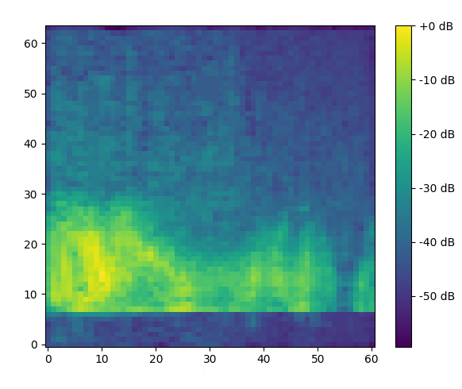
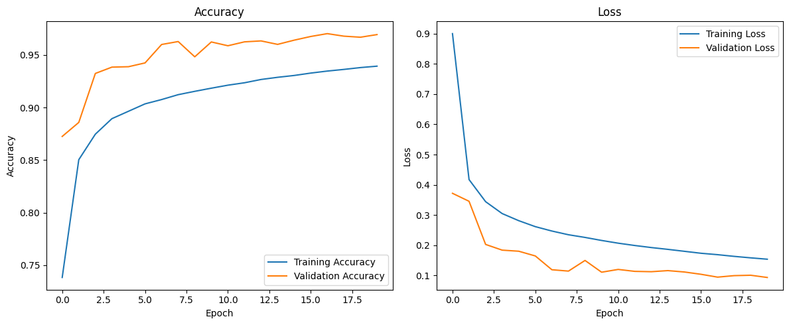

# Raspberry Pi Zero 2W Keyword Spotting with TensorFlow

## Project Overview
In this project, we’ll build a keyword spotting system using a Raspberry Pi Zero 2W. The goal is to recognize specific keywords or phrases in audio input captured from a GPIO-connected microphone. We’ll leverage the “speech_commands” dataset from TensorFlow, create a processing pipeline within TensorFlow, develop and train a CNN model in Google Colab, save and convert it to TensorFlow Lite (TFLite), and finally run it on the Raspberry Pi.

## Key Steps
1. Data Preparation:
   - We’ll use the “speech_commands” dataset, which contains audio samples of various keywords (e.g., “yes,” “no,” “stop,” “go”).
   - Split longer audio files into 1-second segments.
   - Select specific classes of interest (target keywords).
   - Label other classes as out-of-distribution (OOD) sample (unknown).
   - **Augment** available training data by exploiting several techniques, such as adding noise to the waveform.
2. Audio Preprocessing:
   - Squeeze and normalize the audio files.
   - Compute the **Mel Spectogram** from the audio files. Here is an example of what a Mel Spectogram looks like:
     
3. Model Development and Training in Colab:
   - The model should be constrained to the capabilities of Raspberry Pi Zero 2W.
   - CNN Architecture has been defined in order to achieve excellent performance despite the size and latency constraints.
   - In order to reduce number of parameters, I suggest to employ efficient convolution modules, such as **SeparableConv2D** and **DepthwiseConv2D**. By using a mix of these layers, we can deploy a **50k parameter** model which indeed does the job.
   - Implement some kind of **regularization**, such as kernel regularizer or applying dropout onto some layers.
   - Make the model even more robust by applying random transformation to the sampled mel-spectrograms, such as **masking** some values. 
   - Optimize hyperparameters (e.g., learning rate, batch size).
   - Once the model is trained and validated (on different splits), we can obtain the graphs for accuracy and loss 
4. Model Conversion to TFLite:
   - Save the trained model.
   - Convert it to TFLite format for efficient deployment on the Raspberry Pi.
5. Deployment on Raspberry Pi Zero 2W:
   - Load the TFLite model onto the Raspberry Pi.
   - Write a Python script that captures real-time audio from the microphone.
   - Process the audio and run inference using the TFLite model.
   - Implement logic to detect keywords and trigger actions (e.g., turning on lights, responding to voice commands).
 
## Usage
1. Clone this repository:
   ```bash
   git clone https://github.com/cicciodepa/pi0-keyword-spotting.git
   cd pi0-keyword-spotting
   ```
2. Run the keyword spotting script on your Raspberry device:
    ```bash
    python pi.py
    ```

## Dataset Speech Commands v2

This project utilizes the Speech Commands dataset created by P. Warden. The dataset is available in the [TensorFlow Datasets catalog](https://www.tensorflow.org/datasets/catalog/speech_commands).


